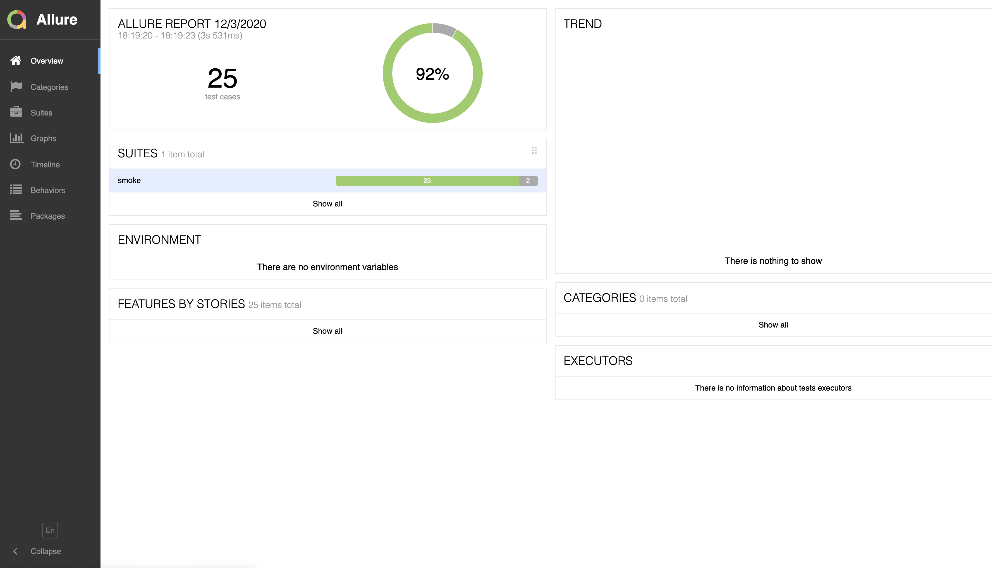
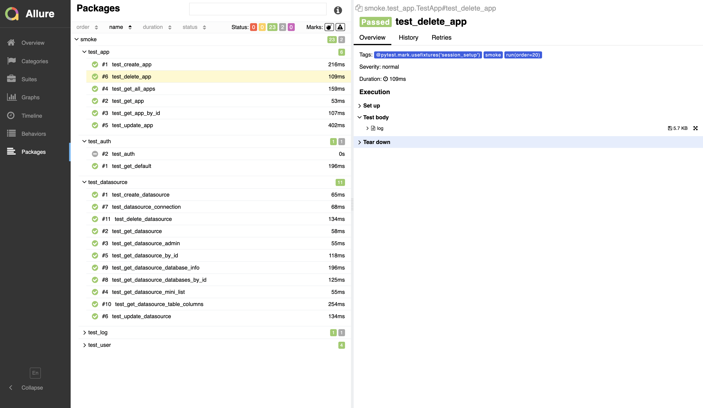

# 接口自动化测试

要点：

- 测试环境治理
  - mock
  - 中间件依赖 db, redis
  - 环境稳定性
- 数据管理
- 测试框架
- ci/cd 持续集成 执行次数、通过率

## 接口自动化测试框架

- 测试用例
  - 简单case 使用 json/yaml + template 格式，基于 关键字 生成接口测试用例。可通过平台完成用例编写。
  - 复杂case 使用 `requests+pytest` 完成接口测试用例编写。（不建议使用平台来编写用例。与ide相比，平台提供定制化、垂直化的功能，缺少通用性和灵活性）
  - 用例编写 分层
    - `api`: 通过 swagger 生成接口定义文档
    - `service`: 提供 rest api 底层逻辑
    - `testcase`: 前置与后置处理、fixture
    - `注解`: 参数化、用例meta元信息（分析与运营）
  - 稳定性、独立性

- 测试数据
  - `excel/json/yaml/db` 格式
  - 录制与回放（baseline 结果对比）
  - 造数：基于数据定义自动生成反向数据、模糊测试数据（Fuzz测试）

- 结果断言
  - 基于 json schema 断言
  - baseline 结果对比，json deep diff

- 工具类
  - utils
    - http
      - session 连接配置（长连接、连接池、请求超时）
      - 请求支持重试
      - aop plugin
    - io, string, datetime
  - client
    - db, redis

- 测试执行
  - 配置 支持多个环境
  - pytest 执行维度支持优先级、关键字、组
  - 并行执行（用例间不存在依赖）
  - 容器化部署和执行
  - 执行日志
  - 与 cicd 集成
  - 简单场景压测

- 测试报告
  - allure 插件
  - 自定义测试报告
    - 基于 runner 回调函数

- rest api
  - 提供业务能力支持

### 接口自动化测试平台

- 测试数据管理
- json/yaml 用例编写
- 测试执行、过程监控、测试报告
- 与测试用例平台打通
- 运营：用例分析、测试趋势图、bug分析、覆盖率

## 补充：UI自动化测试框架

> TODO:

## DP-DB-API-Tests

> DP db-portal api tests sample.

### 项目结构

```text
├── README.md
├── apis                 原生api接口调用
│   ├── __init__.py
│   ├── auth.py
│   ├── default.py
│   ├── log.py
│   └── user.py
├── configs              测试执行配置
│   ├── configs-test-vn.ini
│   └── configs.ini
├── main.py
├── outputs              测试输出
│   └── allure           allure测试结果及报告
│   └── pytest.log       测试执行日志
├── run.sh
├── tasks                自动化测试场景（api组合）
├── tests                自动化测试用例（api+场景 组合）
│   ├── __init__.py
│   ├── conftest.py      pytest fixture定义
│   ├── pytest.ini       pytest 配置
│   ├── smoke            冒烟测试用例
│   └── base.py          pytest 测试用例基类
├── tools                测试工具类
│   ├── __init__.py
│   ├── get_pytest_info.py
│   └── testcase_meta.py
└── utils                基础工具类
    ├── __init__.py
    ├── common.py
    ├── configs.py
    └── http_utils.py
```

### 项目准备

依赖库

- requests
- pytest
- pytest-timeout
- pytest-ordering
- pytest-rerunfailures
- pytest-html

### pytest

pytest cli 常用参数：

```text
-s 显示print内容
-k 执行某个关键字的用例，使用python的语法，匹配的范围是文件名、类名、函数名为变量，用 and 来区分
-m 只运行有相应标识的测试用例（@pytest.mark.smoke）

-x, --exitfirst 当遇到错误时停止测试
--maxfail=num 当错误个数到达给定数时，退出测试
--junit-xml=path 输出xml文件格式，与jenkins做集成时使用
--result-log=path 将最后的结果保存到本地文件中
```

pytest cli 执行测试：

```sh
pytest --help

# run all cases in dir
pytest -v -s tests/smoke/
# run cases with marker
pytest -v -s -m "smoke" tests/smoke/

# run specified cases
pytest -v test_se.py::TestClassTwo::test_one
pytest -v test_pytest_markers.py::TestClass test_pytest_markers.py::test_send_http

# run and output html report
pytest -v tests/test_auth.py --html outputs/pytest_results.html
```

pytest 常用装饰器：

- `@pytest.mark.smoke`: 测试用例标签。
- `@pytest.mark.skip(reason='')`: 执行时跳过该测试用例。
- `@pytest.mark.run(order=1)`: 按order顺序执行测试用例。
- `@pytest.mark.flaky(reruns=2, reruns_delay=1)`: 重试执行失败的测试用例。
- `@pytest.mark.timeout(cfg.case_timeout)`: 测试用例执行超时。

### 测试执行 及 测试结果

执行所有的 smoke 测试：

```sh
pytest -v -s tests/smoke
```

执行结果：

```text
==================================================================================================== test session starts =====================================================================================================
platform darwin -- Python 3.7.2, pytest-6.0.1, py-1.9.0, pluggy-0.13.1 -- /Users/jinzheng/.pyenv/versions/3.7.2/envs/env-3.7.2/bin/python3.7
cachedir: .pytest_cache
metadata: {'Python': '3.7.2', 'Platform': 'Darwin-19.6.0-x86_64-i386-64bit', 'Packages': {'pytest': '6.0.1', 'py': '1.9.0', 'pluggy': '0.13.1'}, 'Plugins': {'rerunfailures': '9.1.1', 'html': '3.0.0', 'metadata': '1.11.0', 'ordering': '0.6', 'Faker': '4.1.2', 'allure-pytest': '2.8.22', 'timeout': '1.4.2'}, 'JAVA_HOME': '/Library/Java/JavaVirtualMachines/adoptopenjdk-8.jdk/Contents/Home'}
rootdir: /Users/jinzheng/Workspaces/repos/dp-api-tests/tests, configfile: pytest.ini
plugins: rerunfailures-9.1.1, html-3.0.0, metadata-1.11.0, ordering-0.6, Faker-4.1.2, allure-pytest-2.8.22, timeout-1.4.2
collected 28 items

test_app.py::TestApp::test_create_app
------------------------------------------------------------------------------------------------------- live log setup -------------------------------------------------------------------------------------------------------
[    INFO] create app [id=23] and datasource [id=24]
PASSED
test_app.py::TestApp::test_get_app PASSED
test_app.py::TestApp::test_get_app_by_id PASSED
test_app.py::TestApp::test_get_all_apps PASSED
test_app.py::TestApp::test_update_app PASSED
test_app.py::TestApp::test_delete_app PASSED
test_datasource.py::TestDataSource::test_create_datasource PASSED
test_datasource.py::TestDataSource::test_get_datasource PASSED
test_datasource.py::TestDataSource::test_get_datasource_admin SKIPPED
test_datasource.py::TestDataSource::test_get_datasource_mini_list PASSED
test_datasource.py::TestDataSource::test_get_datasource_by_id PASSED
test_datasource.py::TestDataSource::test_update_datasource PASSED
test_datasource.py::TestDataSource::test_datasource_connection PASSED
test_datasource.py::TestDataSource::test_get_datasource_databases_by_id PASSED
test_datasource.py::TestDataSource::test_get_datasource_database_info PASSED
test_datasource.py::TestDataSource::test_get_datasource_table_columns PASSED
test_datasource.py::TestDataSource::test_delete_datasource PASSED
test_list.py::TestList::test_datasource_manage_data PASSED
test_list.py::TestList::test_list_database PASSED
test_list.py::TestList::test_list_table PASSED
test_auth.py::TestAuth::test_get_default SKIPPED
test_auth.py::TestAuth::test_auth SKIPPED
test_log.py::TestLog::test_get_log PASSED
test_log.py::TestLog::test_log_download SKIPPED
test_user.py::TestUser::test_user_list_all PASSED
test_user.py::TestUser::test_user_list_by_email PASSED
test_user.py::TestUser::test_user_download_by_email PASSED
test_user.py::TestUser::test_user_unfrozen PASSED

=============================================================================================== 24 passed, 4 skipped in 4.48s ================================================================================================
/Users/jinzheng/Workspaces/repos/dp-api-tests
```

### Allure 测试报告

安装 allure 依赖：

```sh
pip install -U allure-pytest
```

mac 本地安装 allure 服务：

```sh
brew install allure

# 检查 allure 是否安装成功
allure --version
```

allure cli 常用命令：

```sh
allure --help
generate   Generate the report
serve      Serve the report
open       Open generated report
```

执行测试并生成 allure 测试报告：

```sh
# 执行测试，生成 allure 测试结果
pytest -v -s tests/smoke --alluredir outputs/allure/results

# 生成 allure 测试报告
allure generate outputs/allure/results -o outputs/allure/reports --clean
# 打开测试报告
allure open outputs/allure/reports
```

allure html 测试报告：





### TODOS:

- google login 自动化
  - 通过 chrome 插件的方式获取 auth

